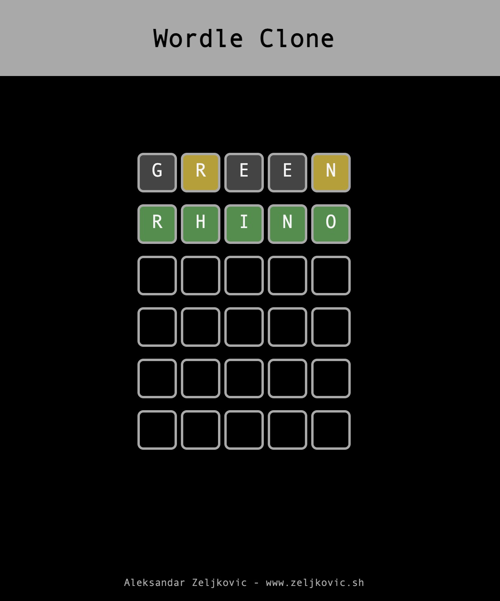

# The Wordle Clone

<figure style="text-align: center;">
    
</figure>

---

My implementation of Wordle made with vanilla JavaScript, HTML and CSS. It has only one dependency-Parcel.

You can give it a try at: https://cosmic-cajeta-1e467b.netlify.app/
